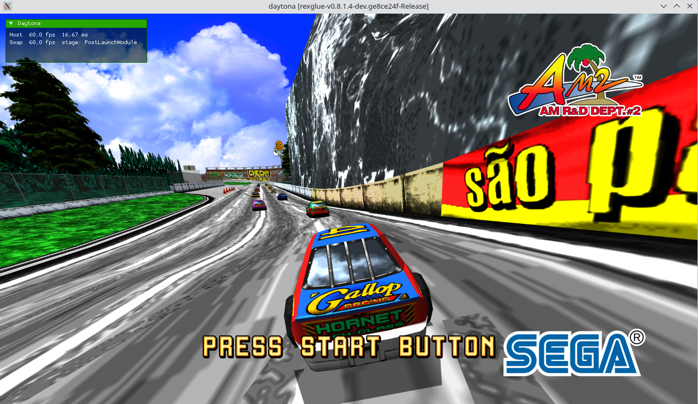

# Daytona USA ReXGlue Recompilation



This project is a static recompilation of Daytona USA (Xbox 360 / XBLA, 2011) using Rexglue.

No copyrighted game files are included. This tree excludes the
extracted game directory, `default.xex`, `pe_image.bin`, media archives, audio,
images, and build outputs.

## Included

```text
config/                         ReXGlue manifest/config files
patches/daytona_working_codegen.patch
docs/CODEGEN_PATCHES.md         notes for the manual codegen patch
ppc/                            PPC metadata headers
project/                        host project sources and CMake files
scripts/extract_game.py         local STFS package extractor
thirdparty/rexglue-sdk           required ReXGlue SDK submodule
```

The host project sources were copied from the running `daytona_working` tree,
including:

```text
project/src/daytona_symbols.h
project/src/stubs.cpp
project/src/main.cpp
```

`project/src/daytona_symbols.h` is the full symbol map from the working version.

## Required Local Game Files

To regenerate codegen or run the project, provide your own legally obtained
Daytona USA XBLA package in:

```text
game/
```

The local package currently used with this tree is:

```text
game/{game_file_with_id}
type: Microsoft Xbox 360 LIVE/STFS package, Arcade Title
title/media: XA-2845, media ID 3CA562D4
size: 240058368 bytes
sha256: db2381451a15a4e537154712213a0309e9ddc33d20bdc03421d80c9939893cef
```

Extract it from the repository root with:

```sh
python3 scripts/extract_game.py
```

The script extracts the STFS package into:

```text
extracted/
```

and copies the executable required by ReXGlue to:

```text
assets/default.xex
```

`config/daytona_manifest.toml` references that executable as:

```text
../assets/default.xex
```

`game/`, `extracted/`, and `assets/` are ignored by git because they contain
copyrighted game files. A successful extraction currently produces 162 files;
the root `default.xex` should be detected by `file` as:

```text
Microsoft Xbox 360 executable (XA-2845, media ID: 3CA562D4), all regions
```

## Required ReXGlue SDK

This recompilation requires this exact ReXGlue SDK branch:

```text
https://github.com/Subarasheese/rexglue-sdk.git
branch: daytonaxbla
```

It is vendored as a git submodule at:

```text
thirdparty/rexglue-sdk
```

After cloning this repository, initialize it with:

```sh
git submodule update --init --recursive
```

If `git submodule status --recursive` prints nothing even though `.gitmodules`
contains `thirdparty/rexglue-sdk`, the submodule was not recorded in the index.
Add it with:

```sh
git submodule add -b daytonaxbla https://github.com/Subarasheese/rexglue-sdk.git thirdparty/rexglue-sdk
git submodule update --init --recursive
```

The current submodule checkout used when this tree was prepared is:

```text
82a88a385c456ccfd82eae2b320955d0f028d92d
```

CMake may warn that no `v*` tag is reachable from the SDK checkout and fall
back to `0.8.0.0-dev.unknown`. That warning did not block configure, codegen, or
the Release build on this tree.

## Regenerate Codegen

From the repository root:

```sh
cmake --preset linux-amd64 -S project
cmake --build project/out/build/linux-amd64 --config Release --target daytona_codegen
```

That target uses the `rex::rexglue` executable built from
`thirdparty/rexglue-sdk`. The `generated/` and `config/generated/` directories
are local codegen outputs and are intentionally ignored by Git.

On this checkout, the `daytona_codegen` target successfully regenerated files
and printed `Done in 4.4s.`, then `rexglue` exited with signal 11 and Ninja
reported the target as failed. Treat the generated files as usable if the run
reaches `Done`, then apply the working patch below.

## Apply Working Codegen Fixes

The working daytona tree has manual fixes on top of regenerated
codegen. Apply them with:

```sh
patch -p0 < patches/daytona_working_codegen.patch
```

The patch changes only generated files. Keep the generated outputs ignored and
commit the patch, not the regenerated files. See `docs/CODEGEN_PATCHES.md` for
the exact files and reasons.

## Build

Configure the project with CMake from `project/`. The build always uses the
vendored `thirdparty/rexglue-sdk` submodule.

Example:

```sh
cmake --preset linux-amd64
cmake --build --preset linux-amd64-release
```

If configuration fails with a missing SDK message, run:

```sh
git submodule update --init --recursive
```

The Daytona target directly compiles SDK sources including `rex_app.cpp`, so it
needs two SDK include paths in `project/CMakeLists.txt`:

```text
thirdparty/rexglue-sdk/thirdparty/imgui
project/out/build/linux-amd64/rexglue-sdk/include
```

Without them, the Release build fails with missing `imgui.h` or
`rex/version.h`.

## Run

The executable links against SDK shared libraries from the build output. Run it
with `LD_LIBRARY_PATH`, and provide the extracted game directory as
`--game_data_root`:

```sh
LD_LIBRARY_PATH="$PWD/thirdparty/rexglue-sdk/out/linux-amd64/Release" \
  project/out/build/linux-amd64/Release/daytona \
  --game_data_root="$PWD/extracted"
```

For a short smoke test that does not leave the process running:

```sh
mkdir -p logs
timeout 20 env \
  DISPLAY=:1 \
  GDK_BACKEND=x11 \
  LD_LIBRARY_PATH="$PWD/thirdparty/rexglue-sdk/out/linux-amd64/Release" \
  project/out/build/linux-amd64/Release/daytona \
  --game_data_root="$PWD/extracted" \
  --log_file="$PWD/logs/daytona_run.log" \
  --log_level=debug
```

`logs/` and `*.log` are ignored so local runtime logs are not uploaded.

This has been confirmed to build and run from this checkout after extracting the
package, regenerating code, applying `patches/daytona_working_codegen.patch`,
and building the Release preset. During a working run, the log may still print
repeated `NtQueryInformationFile(XFileXctdCompressionInformation) unimplemented`
messages and occasional `Skipping Vulkan frame presentation due to async
placeholder draw usage in this frame` warnings.

If `--game_data_root` is omitted, startup exits immediately with:

```text
[ERROR] --game_data_root was not provided.
```

If `LD_LIBRARY_PATH` is omitted, `ldd project/out/build/linux-amd64/Release/daytona`
shows `librexruntime.so => not found` and `libTracyClient.so => not found`.
